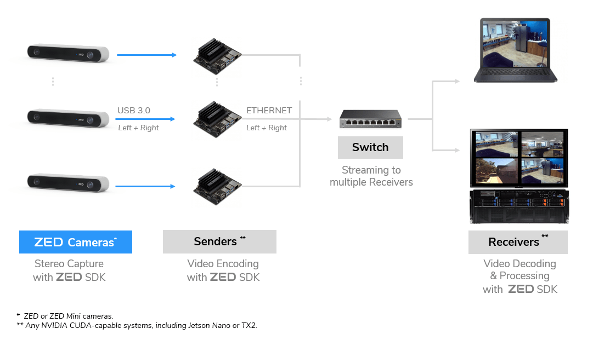

# ZED Local Streaming

Using the ZED SDK, you can stream the side by side video of a ZED camera over a local IP network (Ethernet or Wifi).

Devices with the proper permissions can access the live feed from anywhere using the ZED SDK on the receiving end. When taking a stream as input, the ZED API will behave as if a camera is directly connected to the PC. Every module of the ZED API will be available: depth, tracking, spatial mapping and more.

To stream the video of a ZED camera, refer to the [Camera Streaming](https://github.com/qt-truong/zed-examples/tree/master/10-Samples/camera%20streaming) sample.


**Overview**

* [Hardware Requirements](https://github.com/qt-truong/zed-examples/tree/master/02-LocalStreaming#hardware-requirements)
* [Streaming Modes](https://github.com/qt-truong/zed-examples/tree/master/02-LocalStreaming#streaming-modes)
* [Streaming Protocol](https://github.com/qt-truong/zed-examples/tree/master/02-LocalStreaming#hardware-requirements)
* [Multi-Camera Stream from One Host](https://github.com/qt-truong/zed-examples/tree/master/02-LocalStreaming#multi-camera-stream-from-one-host)
* [Multi-Camera Stream from Different Hosts](https://github.com/qt-truong/zed-examples/tree/master/02-LocalStreaming#multi-camera-stream-from-different-hosts)
* [Using the Streaming API](https://github.com/qt-truong/zed-examples/tree/master/02-LocalStreaming#using-the-streaming-api)
* [Code Example](https://github.com/qt-truong/zed-examples/tree/master/02-LocalStreaming#code-example)

## Hardware Requirements
When streaming live video, hardware acceleration is used to perform real-time encoding and decoding with minimal overhead. It is available on Nvidia GeForce, Quadro, Tesla and embedded Jetson boards (Nano, TX2, Xavier). There are some limitations regarding the number of concurrent encoding sessions, so make sure to check the [Desktop GPU Support Matrix](https://developer.nvidia.com/video-encode-decode-gpu-support-matrix) or [Jetson Support Matrix](https://www.stereolabs.com/blog/h-264-h-265-video-encoding-support-matrix-for-nvidia-jetson/) to determine the appropriate hardware for your use case.

## Streaming Modes
The ZED SDK can stream video using either `H264` or `H265` encoding modes.


### Recommended Bit Rates
When streaming video content over the network, the user can define a specific bitrate. A low bitrate will degrade the quality of the images but requires less bandwidth to transmit over the network. On the other hand, a high bitrate will provide high-quality images with low compression artifacts but the required bandwidth will go up and might create freeze or drop frames.

Below are recommended streaming bitrates depending on the encoder, target resolution and FPS.


<table>
<tbody>
	<tr>
		<th>Encoder</th>
  	<th>Video Mode</th>
    <th>Resolution <br>(side by side)</th>
		<th>FPS</th>
		<th>Bitrate <span style="text-transform: lowercase">(kbits/s)</th>
    <th>Platform Required</th>
	</tr>
	<tr>
		<td valign="top"><b>H.264 (AVCHD)</b></td>
    <td valign="top">2K</td>
    <td valign="top">4416x1242</td>
		<td valign="top">15</td>
		<td valign="top">8500</td>
		<td valign="top">NVIDIA GPU with hardware encoder, NVIDIA Jetson</td>
	</tr>		
	<tr>
		<td valign="top"></td>
    <td valign="top">HD1080</td>
    <td valign="top">3840x1080</td>
		<td valign="top">30</td>
		<td valign="top">12500</td>
		<td valign="top"></td>
	</tr>
	<tr>
		<td valign="top"></td>
    <td valign="top">HD720</td>
    <td valign="top">2560x720</td>
		<td valign="top">60</td>
		<td valign="top">7000</td>
		<td valign="top"></td>
	</tr>
	<tr>
		<td valign="top"><b>H.265 (HEVC)<b></td>
    <td valign="top">2K</td>
    <td valign="top">4416x1242</td>
		<td valign="top">15</td>
		<td valign="top">7000</td>
		<td valign="top">NVIDIA GPU (Pascal or above) with hardware encoder, NVIDIA Jetson</td>
	</tr>
	<tr>
		<td valign="top"></td>
    <td valign="top">HD1080</td>
    <td valign="top">3840x1080</td>
		<td valign="top">30</td>
		<td valign="top">11000</td>
		<td valign="top"></td>
	</tr>
	<tr>
		<td valign="top"></td>
    <td valign="top">HD720</td>
    <td valign="top">2560x720</td>
		<td valign="top">60</td>
		<td valign="top">6000</td>
		<td valign="top"></td>
	</tr>
</tbody>
</table>


### Benefits of Hardware Encoding
Both `H264` and `H265` encoding modes have been designed to use the hardware encoder built into NVIDIA GPUs (known as NVENC). With encoding offloaded to NVENC, the GPU and CPU are free for other operations. For example, in a compute-heavy scenario, it is possible to stream a video at full frame rate with minimal impact on the main application.

### Encoding Quality
At a given bitrate, hardware encoding quality can vary depending on your GPU generation. The updated NVENC encoder on Turing-based NVIDIA GPUs (RTX 20-Series, Jetson Xavier) will typically produce superior quality than encoders on older generation GPUs (GTX 10-Series, Jetson Nano).


## Streaming Protocol
The streaming module uses the **RTP** protocol to send and receive the video feed. If not specified, the sender will use the port 30000 and 30001 while the receiver will use ports that are determined as below:

* Try opening the same PORT as the sender.
* If not available, try opening PORT + 2.
* Continue testing new ports until one is available.

Here is an example where multiple ZED cameras are streaming video to one single host machine:

<table>
<tbody>
	<tr>
		<th></th>
		<th>Sender Port</th>
    	<th>Receiver Port</th>
	</tr>
	<tr>
		<td valign="top"><b>Camera #1</b></td>
		<td valign="top">30000 (default)</td>
		<td valign="top">30000</td>
	</tr>		
	<tr>
		<td valign="top"><b>Camera #2</b></td>
		<td valign="top">30000 (default)</td>
		<td valign="top">30002</td>
	</tr>
	<tr>
		<td valign="top"><b>Camera #3</b></td>
		<td valign="top">30000 (default)</td>
		<td valign="top">30004</td>
	</tr>
	<tr>
		<td valign="top"><b>Camera #4</b></td>
		<td valign="top">40000</td>
		<td valign="top">40000</td>
	</tr>
</tbody>
</table>


To get the ports opened by the receiver, use the following command on Linux:

```shell
$ sudo lsof -i -P -n
```

## Multi-Camera Stream from One Host
You can encode and stream videos from multiple cameras connected to a single PC. There is a maximum number of concurrent hardware encoding sessions that can be started on a single NVIDIA GPU. Make sure to check the [NVENC support matrix](https://developer.nvidia.com/video-encode-decode-gpu-support-matrix) or [Jetson support matrix](https://www.stereolabs.com/blog/h-264-h-265-video-encoding-support-matrix-for-nvidia-jetson/) to determine the appropriate hardware requirements.

## Multi-Camera Stream from Different Hosts
It is also possible to stream video from several cameras connected to edge computers or gateways. Below is an example workflow.


In this configuration, the Senders are responsible for encoding and streaming an attached ZED’s video via the local network. On the other side, the Receivers read the stream and process the images using the ZED SDK. Therefore, the Receivers also require an NVIDIA GPU for NVENC decoding and SDK use.

Both the Senders and Receivers must be connected to the same local network. For improved bandwidth, connect the Senders and Receivers via Gigabit Ethernet instead of Wi-Fi. All ZED 2, ZED and ZED Mini cameras support Streaming with the ZED SDK.


## Using the Streaming API

### Streaming Configuration

To stream the video content of a ZED camera, you need to enable the streaming module with `enableStreaming()`. The standard `grab()` function will grab a frame and send it over the local network.

Use `StreamingParameters` to specify settings like bitrate, port, etc. Then pass those parameters when you call `enableStreaming()`.

**C++**
```cpp
// Set the streaming parameters
sl::StreamingParameters stream_params;
stream_params.codec = sl::STREAMING_CODEC::H264; // Can be H264 or H265
stream_params.bitrate = 8000;
stream_params.port = 30000; // Port used for sending the stream
// Enable streaming with the streaming parameters
err = zed.enableStreaming(stream_params);

while (!exit_app) {
    zed.grab();
}
// Disable streaming
zed.disableStreaming();
```

**Python**
```python
# Set the streaming parameters
stream = sl.StreamingParameters()
stream.codec = sl.STREAMING_CODEC.H264 # Can be H264 or H265
stream.bitrate = 8000
stream.port = 30000 # Port used for sending the stream
# Enable streaming with the streaming parameters
err = zed.enable_streaming(stream)

while !exit_app :
    zed.grab()

# Disable streaming
zed.disable_streaming()
```

**C#**
```csharp
// Enable streaming with the streaming parameters
err =  zed.EnableStreaming(STREAMING_CODEC.H264_BASED, 8000, 30000);

RuntimeParameters runtimeParameters = new RuntimeParameters();
while (!exit_app) {
    zed.Grab(ref runtimeParameters);
}
// Disable streaming
zed.DisableStreaming();
```

### Using a Stream as SDK Input

Video content streamed from a ZED camera is accessible remotely and can be used as standard input for the ZED API. Therefore, every ZED API module will work as if the camera was directly connected to the device. To use a remote stream as input, specify the IP address and the port of the sender in `initParameters`. Then call `open()` to open the camera from the stream and `grab()` to grab a new frame and do the processing you want.


**C++**
```cpp
// Set the input from stream
InitParameters initParameters;
initParameters.input.setFromStream("127.0.0.1", 30000); // Specify the IP and port of the sender
// Open the camera
ERROR_CODE err = zed.open(initParameters);
if (err != ERROR_CODE::SUCCESS)
    exit(-1);

while (!exit_app) {
    if (zed.grab() == ERROR_CODE::SUCCESS) {
        // Any processing
    }
}
// Close the camera
zed.close();
```

**Python**
```python
# Set the input from stream
init = sl.InitParameters()
init.set_from_stream("127.0.0.1", 30000) # Specify the IP and port of the sender
# Open the camera
err = zed.open(init)
if err != sl.ERROR_CODE.SUCCESS:
	exit(1)

while !exit_app:
    if zed.grab() == sl.ERROR_CODE.SUCCESS):
        # Any processing

# Close the camera
zed.close()
```

**C#**
```csharp
// Set the input from stream
InitParameters initParameters = new InitParameters();
initParameters.inputType = INPUT_TYPE.STREAM; 
initParameters.ipStream = "127.0.0.1"; // Specify the IP of the sender
initParameters.portStream = "30000"; // Specify the port of the sender

RuntimeParameters runtimeParameters = new RuntimeParameters();
// Open the camera
ERROR_CODE err = zed.Open(ref initParameters);
if (err != ERROR_CODE.SUCCESS)
    Environment.Exit(-1);

while (!exit_app) {
    if (zed.Grab(ref runtimeParameters) == ERROR_CODE.SUCCESS) {
        // Any processing
    }
}
// Close the camera
zed.Close();
```

## Code Example

See the [Camera Streaming](https://github.com/qt-truong/zed-examples/tree/master/10-Samples/camera%20streaming) samples for more information on streaming a video and using a stream as input.