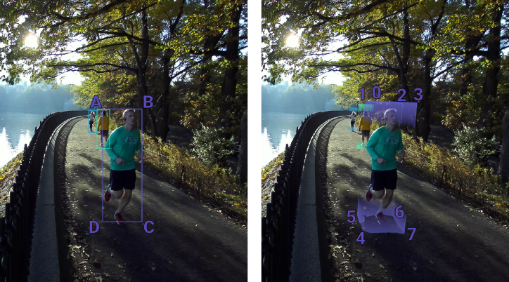

# Object Detection

Object detection is the ability to identify objects present in an image. Thanks to depth sensing and 3D information, the ZED camera is able to provide the 2D and 3D position of the objects in the scene.

**Overview**

* [Object Detection Configuration](https://github.com/qt-truong/zed-examples/tree/master/07-ObjectDetection#object-detection-configuration)
* [Getting Object Data](https://github.com/qt-truong/zed-examples/tree/master/07-ObjectDetection#getting-object-data)
* [Code Example](https://github.com/qt-truong/zed-examples/tree/master/07-ObjectDetection#code-example)

## Object Detection Configuration
To configure object detection, use `ObjectDetectionParameters` at initialization and `ObjectDetectionRuntimeParameters` to change specific parameters during use.

**C++**
```cpp
// Set initialization parameters
ObjectDetectionParameters detection_parameters;
detection_parameters.enable_tracking = true; // Objects will keep the same ID between frames
detection_parameters.enable_mask_output = true; // Outputs 2D masks over detected objects

// Set runtime parameters
ObjectDetectionRuntimeParameters detection_parameters_rt;
detection_parameters_rt.detection_confidence_threshold = 25;
```

**Python**
```python
# Set initialization parameters
detection_parameters = sl.ObjectDetectionParameters()
detection_parameters.enable_tracking = true

# Set runtime parameters
detection_parameters_rt = sl.ObjectDetectionRuntimeParameters()
detection_parameters_rt.detection_confidence_threshold = 25
```

**C#**
```csharp
// Set initialization parameters
ObjectDetectionParameters detection_parameters = new ObjectDetectionParameters();
detection_parameters.enableObjectTracking = true; // Objects will keep the same ID between frames

// Set runtime parameters
ObjectDetectionRuntimeParameters detection_parameters_rt = new ObjectDetectionRuntimeParameters();
detection_parameters_rt.detectionConfidenceThreshold = 35;
```

If you want to track objects' motion within their environment, you will first need to activate the [positional tracking](https://www.stereolabs.com/docs/positional-tracking/) module. Then, set `detection_parameters.enable_tracking` to `true`.

**C++**
```cpp
if (detection_parameters.enable_tracking) {
    // Set positional tracking parameters
    PositionalTrackingParameters positional_tracking_parameters;
    positional_tracking_parameters.set_floor_as_origin = true;

    // Enable positional tracking
    zed.enablePositionalTracking(positional_tracking_parameters);
}
```

**Python**
```python
if detection_parameters.enable_tracking :
    # Set positional tracking parameters
    positional_tracking_parameters = sl.PositionalTrackingParameters()
    positional_tracking_parameters.set_floor_as_origin = true

    # Enable positional tracking
    zed.enable_positional_tracking(positional_tracking_parameters)
```

**C#**
```csharp
if (detection_parameters.enableObjectTracking ) {
  // Set positional tracking parameters
  PositionalTrackingParameters trackingParams = new PositionalTrackingParameters();
  trackingParams.setFloorAsOrigin = true;
  // Enable positional tracking
  zed.EnablePositionalTracking(ref trackingParams);
  }
```

With these parameters configured, you can enable the object detection module:

**C++**
```cpp
// Enable object detection with initialization parameters
zed_error = zed.enableObjectDetection(detection_parameters);
if (zed_error != ERROR_CODE::SUCCESS) {
    cout << "enableObjectDetection: " << zed_error << "\nExit program.";
    zed.close();
    exit(-1);
}
```

**Python**
```python
# Enable object detection with initialization parameters
zed_error = zed.enable_object_detection(detection_parameters)
if zed_error != sl.ERROR_CODE.SUCCESS :
    print("enable_object_detection", zed_error, "\nExit program.")
    zed.close()
    exit(-1)
```

**C#**
```csharp
// Enable object detection with initialization parameters
zed_error = zedCamera.EnableObjectDetection(ref detection_parameters);
if (zed_error != ERROR_CODE.SUCCESS) {
    Console.WriteLine("enableObjectDetection: " + zed_error + "\nExit program.";
    zed.Close();
    Environment.Exit(-1);
}
```

**Note:** Object Detection has been optimized for ZED 2 wide angle field of view and uses the camera motion sensors for improved reliablity. Therefore the Object Detection module requires ZED 2, and sensors cannot be disabled when using the module.


## Getting Object Data

To get the dectected objects in a scene, get an new image with `grab(...)` and extract the detected objects with `retrieveObjects()`. The objects'  2D positions are related to the left image, while the 3D positions are wheter in the `CAMERA` or `WORLD` referential depending on `RuntimeParameters.measure3D_reference_frame` (given to the `grab()` function).

**C++**
```cpp
sl::Objects objects; // Structure containing all the detected objects
if (zed.grab() == ERROR_CODE::SUCCESS) {
  zed.retrieveObjects(objects, detection_parameters_rt); // Retrieve the detected objects
}
```

**Python**
```python
objects = sl.Objects() # Structure containing all the detected objects
if zed.grab() == sl.ERROR_CODE.SUCCESS :
  zed.retrieve_objects(objects, obj_runtime_param) # Retrieve the detected objects
```

**C#**
```csharp
sl.Objects objects = new sl.Objects(); // Structure containing all the detected objects
RuntimeParameters runtimeParameters = new RuntimeParamters();
if (zed.Grab(ref runtimeParameters) == ERROR_CODE.SUCCESS) {
  zed.RetrieveObjects(ref objects, ref obj_runtime_param); // Retrieve the detected objects
}
```

The `sl::Objects` class stores all the information regarding the different objects present in the scene in it `object_list` attribute. Each individual object is stored as a `sl::ObjectData` with all information about it, such as bounding box, position, mask, etc. All objects from a given frame are stored in a vector within `sl::Objects`. `sl::Objects` also contains the timestamp of the detection, which can help connect the objects to the images.

You can iterate through the objects as follows:

**C++**
```cpp
for(auto object : objects.object_list)
  std::cout << object.id << " " << object.position << std::endl;
```

**Python**
```python
for object in objects.object_list:
  print("{} {}".format(object.id, object.position))
```

**C#**
```csharp
for (int idx = 0; idx < objects.numObject; idx++)
  Console.WriteLine(objects.objectData[idx].id + " " + objects.objectData[idx].position);
```

Each detected object can be accessed by using its ID as follows:

**C++**
```cpp
sl::ObjectData object;
objects.getObjectDataFromId(object, 0); // Get the object with ID = O
```

**Python**
```python
object = sl.ObjectData()
objects.get_object_data_from_id(object, 0); # Get the object with ID = O
```

**C#**
```csharp
sl.Objects object = new sl.Objects();
for (int idx = 0; idx < objects.numObject; idx++)
  if (objects.objectData[idx].id == 0)
    object = objects.objectData[idx];
```

### Accessing Object Information

Once an `sl::ObjectData` is retreived from the object vector, you can access information such as its ID, position, velocity, label, and tracking_state:

**C++**
```cpp
unsigned int object_id = object.id // Get the object id
sl::float3 object_position = object.position // Get the object position
sl::float3 object_velocity = object.velocity // Get the object velocity
sl::OBJECT_TRACKING_STATE object_tracking_state = object.tracking_state // Get the tracking state of the object
if(object_tracking_state == sl::OBJECT_TRACK_STATE::OK){
    cout << "Object " << object_id << " is tracked" << endl;
}
```

**Python**
```python
object_id = object.id # Get the object id
object_position = object.position # Get the object position
object_velocity = object.velocity # Get the object velocity
object_tracking_state = object.tracking_state # Get the tracking state of the object
if object_tracking_state == sl.OBJECT_TRACK_STATE.OK :
    print("Object {0} is tracked\n".format(object_id))
```

**C#**
```csharp
uint object_id = object.id // Get the object id
Vector3 object_position = object.position // Get the object position
Vector3 object_velocity = object.velocity // Get the object velocity
OBJECT_TRACK_STATE object_tracking_state = object.objectTrackingState; // Get the tracking state of the object
if(object_tracking_state == sl.OBJECT_TRACK_STATE.OK){
    Console.WriteLine("Object " + object_id + " is tracked");
}
```

You can also access the confidence of the detection for each object. This confidence depicts the probability of a detected object to really be present in the scene. Therefore, this confidence can be used to post-filter the detected objects. For example, you can ignore objects with a confidence less than 10%:

**C++**
```cpp
for(auto object : objects.object_list){
  if(object.confidence < 0.1f)
    continue;
  // Work with other objects
}
```

**Python**
```python
for object in objects.object_list:
  if object.confidence < 0.1 :
    continue
  # Work with other objects
```

**C#**
```csharp
for (int idx = 0; idx < objects.numObject; idx++){
  if(objects.objectData[idx].confidence < 0.1f)
    continue;
  // Work with other objects
}
```

### Getting 3D Bounding Boxes
Each detected object contains two bounding boxes: a 2D bounding box and a 3D bounding box. The 2D bounding box is defined in the image frame while the 3D bounding box is provided with the depth information.

The 2D bounding box is represented as four 2D points starting from the top left corner of the object. The 3D bounding box is represented by eight 3D points starting from the top left front corner, as follows:



The 2D and 3D bounding boxes are accessible in `sl::ObjectData`:

**C++**
```cpp
vector<sl::uint2> object_2Dbbox = object.bounding_box_2d; // Get the 2D bounding box of the object
vector<sl::float3> object_3Dbbox = object.bounding_box; // Get the 3D bounding box of the object
```

**Python**
```python
object_2Dbbox = object.bounding_box_2d; # Get the 2D bounding box of the object
object_3Dbbox = object.bounding_box; # Get the 3D Bounding Box of the object
```

**C#**
```csharp
Vector2[] object_2Dbbox = objects.objectData[idx].boundingBox2D; // Get the 2D bounding box of the object
Vector3[] object_3Dbbox = objects.objectData[idx].boundingBox; // Get the 3D bounding box of the object
```


### Getting the Object Mask

Each object can also be represented by its mask. The mask includes the pixels within the 2D bounding box that belong to the object. Pixels from the object itself are set to 255 while the pixels of the background are set to 0. You can access the mask of an object with `sl::Mat object_mask = object.mask;`.


## Code Example
For code examples, check out the [Tutorial](https://github.com/qt-truong/zed-examples/tree/master/09-Tutorials/tutorial%206%20-%20object%20detection) and [Sample](https://github.com/qt-truong/zed-examples/tree/master/10-Samples/object%20detection).