# Overview

Thanks to its comprehensive API, ZED cameras can be interfaced with multiple third-party libraries and environments.

| | Integration     | Description |
| :---: | ---------- | ----------  |
| 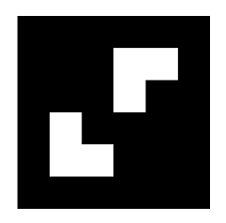 | **[ZED Aruco](https://github.com/stereolabs/zed-aruco/)** | Shows how to track or relocalize the position of one or multiple cameras using an Aruco marker. |
| 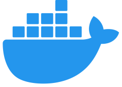 | **[ZED Docker](https://github.com/stereolabs/zed-docker)** | Shows how to run the ZED SDK in a Docker container. |
|  | **[ZED GStreamer](https://github.com/stereolabs/zed-gstreamer)** | Plugins to use the ZED and its SDK in a GStreamer pipeline. |
| 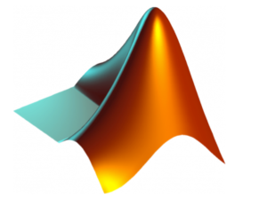 | **[ZED Matlab](https://github.com/stereolabs/zed-matlab)** | Allows to use the ZED and its SDK in Matlab. |
| 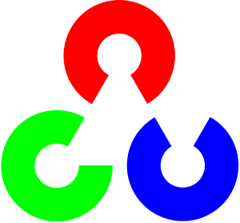 | **[ZED OpenCV](https://github.com/stereolabs/zed-opencv)** | Shows how to capture image, depth and point cloud and convert them to OpenCV format. |
| 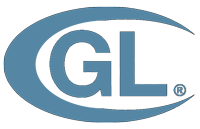 | **[ZED OpenGL](https://github.com/stereolabs/zed-opengl)** | Shows how to use GPU memory to display camera ../media and depth using OpenGL. |
| 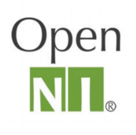 | **[ZED OpenNI2](https://github.com/stereolabs/zed-openni)** | OpenNI2 driver for the ZED stereo camera family. |
| 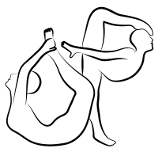 | **[ZED OpenPose](https://github.com/stereolabs/zed-openpose)** | Uses ZED SDK and OpenPose skeleton detection to display real-time multi-person 3D pose of human bodies. |
|  | **[ZED PCL](https://github.com/stereolabs/zed-pcl)** | Shows how to acquire and display a 3D point cloud with PCL (Point Cloud Library). |
| 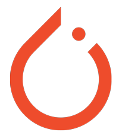 | **[ZED PyTorch](https://github.com/stereolabs/zed-pytorch)** | Uses ZED SDK and PyTorch to detect, segment, classify and locate objects in 3D. |
| 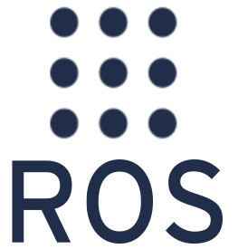 | **[ZED ROS](https://github.com/stereolabs/zed-ros-wrapper)/[ZED ROS2](https://github.com/stereolabs/zed-ros2-wrapper)** | Provides access to ZED data through ROS topics and services. |
| 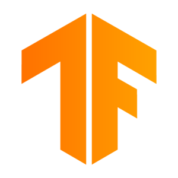 | **[ZED TensorFlow](https://github.com/stereolabs/zed-tensorflow)** | Uses ZED SDK and TensorFlow to detect, classify and locate objects in 3D. |
| 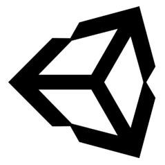 | **[ZED Unity Plugin](https://github.com/stereolabs/zed-unity)** | Provides access to ZED SDK features in Unity. |
|  | **[ZED Unreal Plugin](https://github.com/stereolabs/zed-unreal-plugin)** | Provides access to ZED SDK features in UE4. |
|  | **[ZED Yolo](https://github.com/stereolabs/zed-yolo)** | Uses ZED SDK and YOLO object detection to display the 3D location of objects and people in a scene. |