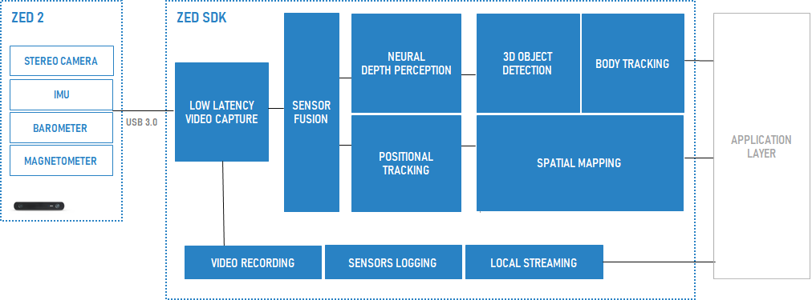

# Introduction

Stereolabs provides cameras that include stereo vision, motion, position and environmental sensors.
Get the best out of the [ZED](https://www.stereolabs.com/store/) cameras thanks to the ZED SDK, a cross-platform library that will let you acces various modules, including:

* **[Video](https://www.stereolabs.com/docs/video/)**: visualize, control and record images coming from your camera.

* **[Sensors](https://www.stereolabs.com/docs/sensors/)**: access your ZED sensors to detect camera movements, relative altitude variations and much more.

* **[Depth Sensing](https://www.stereolabs.com/docs/depth-sensing/)**: thanks to stereo vision technology, capture high-resolution 3D videos of your scene and estimate depth and motion by comparing the displacement of pixels between the left and right images.

* **[Positional Tracking](https://www.stereolabs.com/docs/positional-tracking/)**: track the movement of your camera in 3D space with six degrees of freedom (6DoF).

* **[Spatial Mapping](https://www.stereolabs.com/docs/spatial-mapping/)**: understand and interact with the real-world by creating a 3D map of the environment.

* **[Object Detection](https://www.stereolabs.com/docs/object-detection/)**: identify various objects in your images and get their 2D/3D position in the scene.

* **[Body Tracking](https://www.stereolabs.com/docs/body-tracking/)**: identify people in your images and get their 2D/3D keypoint coordinates in the scene.

# About this repository

The `zed-sdk` umbrella repository gathers all the available repositories from Stereolabs organisation. Each individual repository is linked here as a [git submodule](https://git-scm.com/docs/git-submodule), but you can still clone its dedicated repository independently from `zed-sdk`.

## Content 

* **Tutorials**: get familiar with the ZED SDK API with this series of basic tutorials.

* **Samples**: learn how to use the SDK features to build applications with your ZED camera.

* **Integrations**: interface your ZED camera with multiple third-party libraries and environments.

* **API**: choose your favourite language to get the best out of the SDK thanks to our wrappers. Available languages currently include Python and C#.

# ZED SDK Download

You can find the latest release of the SDK in our [Developer Center](https://www.stereolabs.com/developers/release/)

# ZED SDK Installation

Installation instructions are availble for [Windows](https://www.stereolabs.com/docs/installation/windows/), [Linux](https://www.stereolabs.com/docs/installation/linux/) and [Jetson](https://www.stereolabs.com/docs/installation/jetson/).

# Documentation

General [documentation](https://www.stereolabs.com/docs/) gives in-depth information about the products and their functionalities. You can also check out our [API Reference](https://www.stereolabs.com/docs/api/) for more details about the available functions provided by the SDK.

# Support

If you need help or more informations check our [Support](https://support.stereolabs.com/) page or join our [Community](https://community.stereolabs.com/).