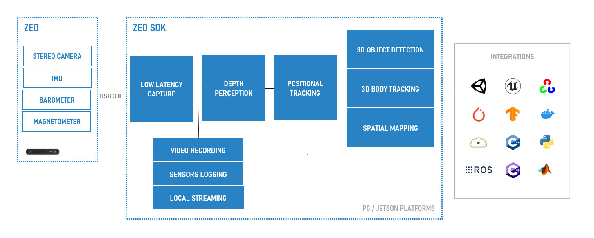

## Introduction

Stereolabs provides cameras that include stereo vision, motion, position and environmental sensors.

Get the best out of the [ZED](https://www.stereolabs.com/store/) cameras thanks to the ZED SDK, a cross-platform library that will let you acces various modules, including:

| Module     | Description |
| ----------- | ---------- |
| **[Video Capture](01-Video-Capture)** | Visualize, control and record images coming from your camera. |
| **[Local Streaming](02-Local-Streaming)** | Stream the side by side video of your ZED camera over a local IP network (Ethernet or Wifi). |
| **[Sensors](03-Sensors)** | Access your ZED sensors to detect camera movements, relative altitude variations and much more. |
| **[Depth Sensing](04-Depth-Sensing)** | Thanks to stereo vision technology, capture high-resolution 3D videos of your scene and estimate depth and motion by comparing the displacement of pixels between the left and right images. |
| **[Positional Tracking](05-Positional-Tracking)** | Track the movement of your camera in 3D space with six degrees of freedom (6DoF). |
| **[Spatial Mapping](06-Spatial-Mapping)**| Understand and interact with the real-world by creating a 3D map of the environment. |
| **[3D Object Detection](07-Object-Detection)** | Identify various objects in your images and get their 2D/3D position in the scene. |
| **[Body Tracking](08-Body-Tracking)** | Identify people in your images and get their 2D/3D keypoint coordinates in the scene. |

## About this repository

The `zed-sdk` umbrella repository gathers all the available repositories from Stereolabs organisation. Each individual repository is linked here as a [git submodule](https://git-scm.com/docs/git-submodule), but you can still clone its dedicated repository independently from `zed-sdk`.

### Content 

Along with dedicated documentation guiding you through the API for each of the above modules, this repository also contains code examples giving you a deeper insight on the ZED SDK capabilities :

* **[Tutorials](09-Tutorials)**: get familiar with the ZED SDK API with this series of basic tutorials.

* **[Samples](10-Samples)**: learn how to use the SDK features to build more complex applications with your ZED camera.

* **[Integrations](11-Integrations)**: interface your ZED camera with multiple third-party libraries and environments.

* **[API](12-API)**: choose your favourite language to get the best out of the SDK thanks to our wrappers. Available languages currently include Python and C#.

## ZED SDK Download

You can find the latest release of the SDK in our [Developer Center](https://www.stereolabs.com/developers/release/)

## ZED SDK Installation

### Supported platforms

The ZED SDK can be installed on a broad range of platforms and you will find installation instructions for the following :

- [Windows10](https://www.stereolabs.com/docs/installation/windows/)
- [Ubuntu (16, 18, 20)](https://www.stereolabs.com/docs/installation/linux/)
- [NVIDIA Jetson](https://www.stereolabs.com/docs/installation/jetson/)

### Recommended specifications

The ZED camera is **UVC (Universal Video Class) compliant** so you can capture the left and right video streams of the ZED on any Windows and Linux platforms. However, getting access to advanced features of the ZED SDK requires proper hardware to offer sustained and optimal performance.

We recommend the following system specifications to use the ZED SDK:

<table>
<tbody>
	<tr>
		<th></th>
		<th>Minimum</th>
		<th>Recommended</th>
    <th>Embedded Systems</th>    
	</tr>
	<tr>
		<td align="left"><b>Processor</b></td>
		<td align="left">Dual-core 2,3GHz</td>
		<td align="left">Quad-core 2,7GHz or faster</td>
		<td align="left">Jetson Nano, TX2, Xavier</td>    
	</tr>
	<tr>
		<td><b>RAM</b></td>
		<td>4GB</td>
		<td>8GB</td>
    <td>8GB</td>    
	</tr>
	<tr>
		<td><b>Graphics Card</b></td>
		<td><b>NVIDIA GPU*</b></a>
		<td>GTX1060 or higher</td>
    <td>Nano, TX2, Xavier</td>    
	</tr>
	<tr>
		<td><b>USB port</b></td>
		<td>USB 3.0</td>
		<td>USB 3.0</td>
    <td>USB 3.0</td>    
	</tr>
	<tr>
		<td><b>Operating System</b></td>
		<td align="center" colspan="2">Windows 10, Ubuntu 16.04, 18.04</td>
		<td>L4T (Jetpack)</td>    
	</tr>
</tbody>
</table>

\* An **NVIDIA GPU** with [Compute Capabilities](https://developer.nvidia.com/cuda-gpus#compute) > 3 is required.

## Documentation

General [documentation](https://www.stereolabs.com/docs/) gives in-depth information about the products and their functionalities. You can also check out our [API Reference](https://www.stereolabs.com/docs/api/) for more details about the available functions provided by the SDK.

## Support

If you need help or more informations check our [Support](https://support.stereolabs.com/) page or join our [Community](https://community.stereolabs.com/).